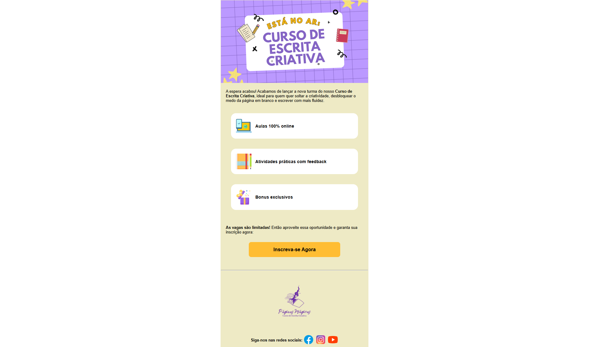

<h1 align="center"> Projeto - E-mail Marketing - Curso Escrita Criativa</h1>

<h3 align="center"> 
	Projeto concluído ✅
</h3>

<h2>💻 Sobre o projeto</h2>

Projeto desenvolvido para prática a construção de e-mail Marketing com HTML utilizando a estrutura de tabelas, para divulgação de um  <a href="https://kmprojetos.great-site.net/escritacriativa/" target="-blank">curso de Escrita Criativa</a>.
 

<h2>🎨 Layout</h2>

<h3><a href="https://kamilenna.github.io/email-mkt-curso-escrita-criativa/">Link do projeto</a></h3>

 

<h2>🛠 Tecnologias</h2>
<ul>
    <li>HTML</li>
    <li>CSS</li>
</ul>

 

<h2>🦸 Autor(a)</h2>
<a href="https://karlamilenna.netlify.app/">
 
  
 <h3><b>Karla Milenna</b></h3></a>